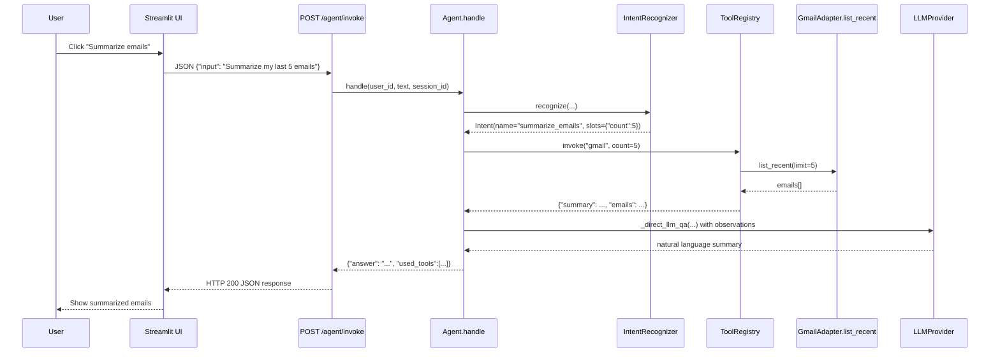
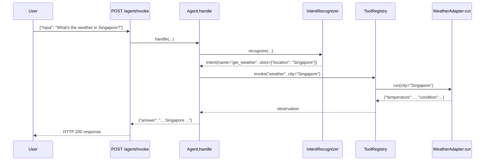
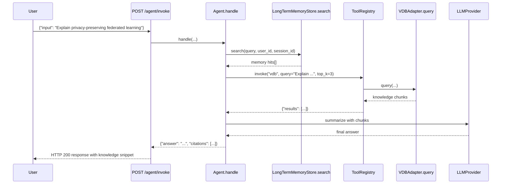

# Agentic AI API with Memory and External Integrations

## Project Overview

Agentic AI ARTc 是一个面向对话式智能体的 FastAPI 服务，提供多模态记忆、工具调用以及简易的 Streamlit Web UI。系统围绕一个多轮对话 Agent 构建，支持：
- 短/中/长程会话记忆（SQLite + 向量库）
- 邮件总结（Gmail API，带 OAuth 授权流程）
- 天气查询（Open-Meteo 默认）
- 知识库检索（Chroma 向量数据库及内存回退）
- 安全控制（Token 鉴权、PII 日志脱敏）

## Quick Start

```powershell
# 1. 克隆并进入项目
cd D:\AI_Learning\LLM\agentic_ai_artc

# 2. 创建并激活虚拟环境
python -m venv .venv
.\.venv\Scripts\Activate.ps1  # PowerShell

# 3. 安装依赖
pip install -r requirements.txt

# 4. 复制并配置环境变量
copy .env.example .env
# 设置 API_TOKEN、LLM_PROVIDER、Google/GPT API 等

# 5. 可选：导入演示知识库
python -m scripts.ingest

# 6. 启动 API
uvicorn app.main:app --reload --port 8000

# 7. 启动 Streamlit UI（新终端）
setx API_BASE "http://127.0.0.1:8000"
setx API_TOKEN "changeme"
streamlit run ui/app.py
```

运行后访问：
- `http://127.0.0.1:8000/docs` 获取 FastAPI 文档
- `http://localhost:8501` 使用交互式 UI

## 🏗️ System Architecture Diagram

```mermaid
graph TD
    UI[Streamlit UI] -->|REST| API[FastAPI Routers]
    API -->|/agent/invoke| AgentCore[Agent Orchestrator]
    API -->|/tools/*| ToolAdapters
    API -->|/memory/*| MemoryAPI
    AgentCore --> ShortMem[ShortTermMemory (RAM)]
    AgentCore --> SessionMem[SessionMemory (SQLite)]
    AgentCore --> LongMem[LongTermMemoryStore (Chroma/Memory)]
    AgentCore --> IntentLLM[LLMProvider]
    ToolAdapters --> Weather[WeatherAdapter -> Open-Meteo]
    ToolAdapters --> Gmail[GmailAdapter -> Gmail REST]
    ToolAdapters --> VDB[VectorDB Adapter -> Chroma]
    LongMem --> VectorStore
    SessionMem --> SQLite[(SQLite sessionMem/mvp.db)]
    VectorStore -->|persist| Storage[(storage/knowledgebase, storage/memory)]
    UI -.-> AdminAPI[/admin/bootstrap/reset/]
    Security[SecurityGuard + Auth] --> AgentCore
    API --> Auth[Auth Router]
```

## 🧠 Core Components Summary

| Component | Purpose | Key Classes / Functions | Dependencies |
|-----------|---------|-------------------------|--------------|
| FastAPI Routers | 提供 REST API 接口（Agent、Tools、Memory、Admin、Auth） | `app/api/*.py` (`include_router` in `app/main.py`) | `fastapi`, `pydantic` |
| Agent Orchestrator | ReAct 推理、工具调用、记忆更新、安全检查 | `Agent` (`app/agent/core.py`), `Step`, `PlanTrace` | LLMProvider, ToolRegistry, Memory stores |
| Memory Layer | 短期 RAM、会话 SQLite、长期向量存储 | `ShortTermMemory`, `SessionMemory`, `LongTermMemoryStore` | `sqlite3`, `chromadb` (fallback to in-memory) |
| Tool Adapters | Gmail、天气、向量库工具的统一封装 | `GmailAdapter`, `WeatherAdapter`, `VDBAdapter`, `ConversationMemoryAdapter` | `google-api-python-client`, `requests`, `chromadb` |
| LLM Provider | 对多家 LLM 的抽象包装，支持 mock / DeepSeek / Gemini / OpenAI | `app/llm/provider.py` | `openai`, `google-generativeai` |
| Guardrails | 入站/出站安全检查、PII Masking | `SecurityGuard`, `MaskPIIFilter` | 自定义逻辑 |
| UI | Streamlit 界面，调用 REST API | `ui/app.py` | `streamlit`, `requests` |

## 🔄 Functional Flow

1. **用户请求**（UI 或直接 API）到 `/agent/invoke`，携带 Bearer Token。
2. **Auth Router** 使用 `require_bearer` 校验 `Authorization` 头部。
3. **Agent.handle**：
   - `_secure_inbound` 在 `SecurityGuard` 下检查敏感输入。
   - 加载短期内存 (`ShortTermMemory`) 和会话上下文 (`SessionMemory.read`)。
   - 检索长期向量记忆 `LongTermMemoryStore.search`（含 user/session 过滤）。
   - 通过 `IntentRecognizer` 调用 `LLMProvider.chat` 识别意图。
4. **计划执行** (`_plan_and_execute`)：
   - 使用 `ToolRegistry.describe()` + LLM 生成下一步 `Step`。
   - 根据 `Step.action` 调 `ToolRegistry.invoke`，分派到对应工具（天气/Gmail/VDB/记忆）。
   - 收集 Observations、Tool trace，并在失败时引导澄清。
5. **回答构建**：
   - `_summarize_result` 对观察结果进行二次总结。
   - `_secure_outbound` 恢复/遮蔽敏感信息。
6. **记忆更新**：
   - 短期记忆追加本轮对话。
   - 会话记忆 `SessionMemory.write` 存储完整上下文。
   - 长期记忆 `LongTermMemoryStore.store_conversation` 向向量库持久化新对话。
7. **响应返回**：包括 `answer`、`used_tools`、`steps`、`citations`、`trace` 等结构化字段。

## 💾 Memory Design

- **短期记忆**：RAM 中维护最近 N 轮对话。
- **Session Memory** (`SQLiteStore`):
  - 表 `memories` 保存 `user_id` + `namespace`（session） + `type` + `content`。
  - 支持 TTL、`list_session_contexts` 等操作。
  - `SessionMemory` 作为封装写入/读取/清理逻辑。
- **长期记忆** (`LongTermMemoryStore`):
  - 通过 `VectorStore` 接口封装 Chroma，`where` 参数按 `user_id`/`session_id` 过滤。
  - 若环境无 Chroma，退化为内存向量存储（hash-based embedding）。
- **Tool Memory Adapter**：`ConversationMemoryAdapter.run` 允许工具层直接检索长期记忆。

## 🌐 External Integrations

| Integration | Adapter | External Service | Notes |
|-------------|---------|------------------|-------|
| Weather | `WeatherAdapter` | Open-Meteo REST API（可换 OpenWeather） | 所有 `requests.get` 设置 `timeout=10`，支持城市名或经纬度 |
| Gmail | `GmailAdapter` + `gmail_oauth.py` | Google Gmail API | 包含 OAuth 授权流程、Token 刷新，默认需要预先授权 |
| Vector DB | `VDBAdapter` -> `KnowledgeBaseStore` | Chroma Persistent Client | 支持文档导入、查询、列举、删除；无 Chroma 时使用内存向量 |

## 🔐 Security & Privacy

- **Bearer Token**：`require_bearer` 校验请求头，Token 来自 `.env` 中的 `API_TOKEN`。
- **管理员登录**：`/auth/login` 校验 `ADMIN_USERNAME` / `ADMIN_PASSWORD`，返回 Bearer Token。
- **SecurityGuard**：对话输入输出进行 PII mask/unmask（如邮箱、Token）。
- **日志**：`MaskPIIFilter` 避免敏感字段泄露。
- **CORS**：通过设置 `CORS_ALLOW_ORIGINS` 控制访问源。
- **长记忆过滤**：`LongTermMemoryStore.search` 强制按用户/会话过滤结果，防止数据串读。

## 🧩 Module Map

```
agentic_ai_artc/
├── app/
│   ├── main.py                 # FastAPI app & router注册
│   ├── api/                    # REST 路由层
│   │   ├── agent.py            # /agent/invoke
│   │   ├── tools.py            # /tools/...
│   │   ├── memory.py           # /memory/...
│   │   ├── admin.py            # /admin/bootstrap, reset
│   │   └── auth.py             # /auth/login
│   ├── agent/                  # Agent 内部逻辑 & ReAct
│   │   ├── core.py             # Agent 主体
│   │   ├── memory.py           # Memory store wrappers
│   │   ├── planning.py         # Step, PlanTrace
│   │   ├── intent.py           # IntentRecognition
│   │   └── toolkit.py          # ToolRegistry
│   ├── tools/                  # 外部工具适配器
│   ├── memory/                 # SQLite/VectorStore 实现
│   ├── llm/                    # LLMProvider
│   ├── security/               # Token 验证
│   ├── guardrails/             # 输入/输出安全
│   ├── schemas/                # Pydantic models
│   └── utils/                  # 配置、日志、文本切分
├── ui/                         # Streamlit 前端
├── scripts/                    # 数据导入脚本
├── storage/                    # SQLite & Chroma 数据
├── tests/                      # Pytest 用例覆盖
└── design_document.md / design_report.md
```

## 🧪 Tests & Use Cases

| Test | Scenario | Key Assertions |
|------|----------|----------------|
| `tests/test_agent.py` | 模拟多轮对话（天气查询、歧义澄清、最大轮次、会话持久化） | 确认 Agent 可以调用工具并保存上下文 |
| `tests/test_tools_weather.py` | `/tools/weather/current` | 响应包含 `temperature` |
| `tests/test_tools_gmail.py` | `/tools/gmail/summary` | 成功或提示需要授权 |
| `tests/test_vdb.py` | 向量库 ingest + query | 成功写入并返回结果 |

### 示例场景

1. **Summarize my last 5 emails**
   - UI 按钮触发 → `/agent/invoke` → `GmailAdapter.list_recent` → LLM summarization。
2. **Weather in Singapore**
   - `/agent/invoke` → `WeatherAdapter.run` → 返回实时天气。
3. **Explain privacy-preserving federated learning**
   - `/agent/invoke` → `VDBAdapter.query` 检索知识 → LLM 整合回答。

## 📊 System-level Call Graphs

### Test Case 1 — Gmail API (Summarize emails)



### Test Case 2 — Weather API (Singapore weather)



### Test Case 3 — Vector DB (Federated learning)



---

## Key Design Highlights

- **ReAct 风格推理**：Agent 每步都通过 LLM 生成下一操作，记录 `PlanTrace`，支持失败澄清。
- **工具抽象统一**：`ToolRegistry` 提供 `describe/invoke`，使 LLM 获得工具元数据并动态调用。
- **记忆安全隔离**：向量检索通过 `where` 条件强制 User/Session 过滤，防止多租户数据泄露。
- **可插拔 LLM**：默认 Mock，有需要可切换至 DeepSeek/Gemini/OpenAI，只需配置 `.env`。
- **前后端联动**：Streamlit UI 通过 `/auth`, `/agent`, `/tools`, `/admin` API 与后端交互。
- **测试覆盖关键路径**：工具 API、Agent 行为、向量库流程均有 Pytest 验证。

---

如需扩展阅读，请参考项目根目录下的 `README.md` 与 `QUICKSTART.md` 获取更多配置细节。该文档提供高层架构视角，可直接纳入课程作业或项目说明中。

