# Agentic AI API with Memory and External Integrations

## Project Overview

Agentic AI Chatbot is a multi-turn FastAPI service that combines reasoning, memory, and tooling in a single agent workflow. It offers:

- **Agent-first architecture** with LLM-driven ReAct planning, `PlanTrace` auditing, and clarification fallbacks.
- **Layered memory stack** that blends short-term RAM, SQLite session state, and Chroma long-term recall with strict user/session scoping.
- **Unified ToolRegistry** powering Gmail (OAuth), weather, vector-DB search, and conversation-recall adapters through a single invoke interface.
- **Pluggable LLM providers** (mock, DeepSeek, Gemini, OpenAI) selected via configuration without code changes.
- **Security guardrails** spanning bearer-token authentication, content sanitization, and logging.
- **Streamlit UI** wired to `/auth`, `/agent`, `/tools`, and `/admin` endpoints for rapid testing and demo flows.

## Quick Start

```powershell
# 1. Clone and navigate
git clone https://github.com/JiangXue0820/agentic_ai_chatbot.git
cd agentic_ai_chatbot

# 2. Create & activate virtual environment (inside the repo)
python -m venv .venv
.\.venv\Scripts\Activate.ps1        # Windows PowerShell
# On macOS/Linux: source .venv/bin/activate

# 3. Install dependencies
pip install -r requirements.txt

# 4. Configure environment
copy env.example .env               # or: cp env.example .env
# Edit .env with your API_TOKEN, LLM_PROVIDER, Gmail creds, etc.

# 5. (Optional) Ingest demo knowledge base
python -m scripts.ingest

# 6. Launch FastAPI
uvicorn app.main:app --reload --host 0.0.0.0 --port 8000

# 7. Launch Streamlit UI in another terminal
$env:API_BASE = "http://127.0.0.1:8000"
$env:API_TOKEN = "changeme"
streamlit run ui/app.py

# Visit:
#   API docs: http://127.0.0.1:8000/docs
#   UI demo : http://localhost:8501
```

## 🧩 Module Map

```
agentic_ai_chatbot/
├── app/
│   ├── main.py                 # FastAPI application entry (router setup)
│   ├── api/                    # REST routes
│   │   ├── agent.py            # /agent/invoke endpoint
│   │   ├── tools.py            # /tools/...
│   │   ├── memory.py           # /memory/...
│   │   ├── admin.py            # /admin/bootstrap, reset
│   │   └── auth.py             # /auth/login
│   ├── agent/                  # Agent internals & ReAct orchestration
│   │   ├── core.py             # Agent main class
│   │   ├── memory.py           # Memory store wrappers
│   │   ├── planning.py         # Step, PlanTrace
│   │   ├── intent.py           # Intent recognition
│   │   └── toolkit.py          # ToolRegistry
│   ├── tools/                  # External tool adapters (Gmail, Weather, VDB, Memory)
│   ├── memory/                 # SQLite & VectorStore implementations
│   ├── llm/                    # LLMProvider abstraction
│   ├── security/               # Token validation helpers
│   ├── guardrails/             # Inbound/outbound safety filters
│   ├── schemas/                # Pydantic models
│   └── utils/                  # Config, logging, file parsing, text splitting
├── ui/                         # Streamlit frontend
├── scripts/                    # Data ingestion scripts
├── storage/                    # SQLite DBs & Chroma persistence
├── tests/                      # Pytest coverage
├── README.md
└── design_report.md

```

## 🏗️ System Architecture Diagram

```mermaid
graph TD
    UI[Streamlit UI] -->|REST| API[FastAPI Routers]
    API -->|/agent/invoke| AgentCore[Agent Orchestrator]
    API -->|/tools/*| ToolAdapters
    API -->|/memory/*| MemoryAPI
    AgentCore --> ShortMem[ShortTermMemory (RAM)]
    AgentCore --> SessionMem[SessionMemory (SQLite)]
    AgentCore --> LongMem[LongTermMemoryStore (Chroma/Memory)]
    AgentCore --> IntentLLM[LLMProvider]
    ToolAdapters --> Weather[WeatherAdapter (Open-Meteo)]
    ToolAdapters --> Gmail[GmailAdapter (Gmail REST)]
    ToolAdapters --> VDB[VectorDB Adapter (Chroma)]
    LongMem --> VectorStore
    SessionMem --> SQLite[(SQLite sessionMem/mvp.db)]
    VectorStore -->|persist| Storage[(storage/knowledgebase, storage/memory)]
    UI -.-> AdminAPI[/admin/bootstrap/reset/]
    Security[SecurityGuard + Auth] --> AgentCore
    API --> Auth[Auth Router]
```

## 🧠 Core Components Summary

| Module | Purpose | Core Implementation | Key Dependencies |
|--------|---------|--------------------|------------------|
| FastAPI routing | Exposes REST endpoints (`/agent`, `/tools`, `/memory`, `/admin`, `/auth`) and wires them into the main ASGI app | `app/main.py`, `app/api/*.py` | `fastapi`, `pydantic` |
| Agent orchestrator | ReAct-style reasoning loop: intent recognition, planning, tool invocation, memory persistence, security checks | `app/agent/core.py`, `app/agent/intent.py`, `app/agent/planning.py`, `app/agent/toolkit.py` | `LLMProvider`, `ToolRegistry`, memory stores |
| Memory system | Combines in-RAM context, SQLite session storage, and Chroma-based long-term recall; supports user/session scoping and TTLs | `ShortTermMemory`, `SessionMemory`, `LongTermMemoryStore` in `app/agent/memory.py`; vector backend in `app/memory/vector_store.py` | `sqlite3`, `chromadb` (with in-memory fallback) |
| Tool adapters | Unified interfaces for Gmail, weather, knowledge base, and conversation recall; each implements a `run`/`query` contract for the registry | `app/tools/gmail.py`, `app/tools/weather.py`, `app/tools/vdb.py`, `app/tools/memory.py` | `google-api-python-client`, `requests`, `chromadb`, document parsing libs |
| LLM provider | Abstracts mock, DeepSeek, Gemini, and OpenAI chat/embedding APIs behind a common interface | `app/llm/provider.py` | `openai`, `google-generativeai`, optional SDKs |
| Guardrails & logging | Inbound/outbound content filtering, PII masking, execution trace logging with masked outputs | `SecurityGuard` (`app/guardrails/security_guard.py`), `configure_logging` (`app/utils/logging.py`) | Custom regex filters, Python logging |
| Web UI | Streamlit dashboard that handles login, agent invocation, document management, and test utilities | `ui/app.py` | `streamlit`, `requests` |

## 🔄 Functional Flow

The flow diagram summarizes the agent pipeline end to end: authentication, content guardrails, context reconstruction, intent recognition, planning & execution, answer synthesis, and memory persistence.

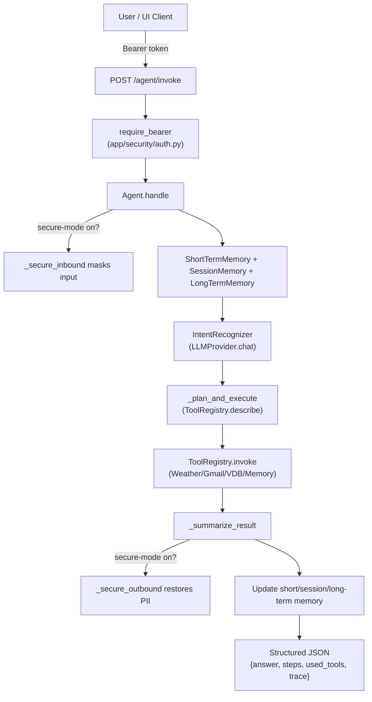


The numbered flow below mirrors the nodes in the agent workflow diagram.

1. **Authenticated request entry** – clients call `POST /agent/invoke` with a bearer token so that `require_bearer` can validate credentials before the agent does any work (source: `app/api/agent.py`, `app/security/auth.py`)

```13:67:app/api/agent.py
@router.post("/invoke", response_model=AgentResponse)
async def invoke(req: AgentInvokeRequest, user=Depends(require_bearer)):
    logger.info(f"[AgentInvoke] user={user['user_id']} session={req.session_id} secure_mode={req.secure_mode}")
    result = agent.handle(
        user_id=user["user_id"],
        text=req.input,
        session_id=req.session_id,
        secure_mode=req.secure_mode,
    )
    ...
```

```1:30:app/security/auth.py
async def require_bearer(authorization: str = Header(None)):
    if not authorization or not authorization.startswith("Bearer "):
        raise HTTPException(status_code=401, detail="Missing bearer token")
    ...
```

2. **Secure inbound sanitization** – when secure-mode is enabled by the UI, `_secure_inbound` masks PII or blocks unsafe content before any further processing (source: `app/agent/core.py`).

```125:152:app/agent/core.py
        if secure_mode:
            masked_input = self._secure_inbound(text)
            if isinstance(masked_input, dict) and masked_input.get("type") == "answer":
                return masked_input
            text = masked_input
```

3. **Read conversation context** – the agent recreates working context by merging short-term memory, the persisted session snapshot, and long-term semantic recall (source: `app/agent/core.py`).

```132:135:app/agent/core.py
        context = self.short_mem.get_context()
        session_ctx = self.session_mem.read(user_id, session_id, "context")
        session_data = {}
```

```139:152:app/agent/core.py
        context = self.short_mem.get_context()
        session_ctx = self.session_mem.read(user_id, session_id, "context")
        ...
        longterm_context = self.longterm_mem.search(
            text,
            top_k=3,
            user_id=user_id,
            session_id=session_id,
        )
        merged_context = self._merge_context(context, longterm_context)
```

4. **Intent recognition** – the agent calls `IntentRecognizer` (backed by `LLMProvider.chat`) to translate the user request plus merged context into structured intents, enabling downstream planning (source: `app/agent/core.py`, `app/agent/intent.py`).

```153:175:app/agent/core.py
        intents = self._recognize_intents(text, merged_context)
        if isinstance(intents, dict) and intents.get("type") == "clarification":
            self.session_mem.write(user_id, session_id, "pending_context", json.dumps(pending_context))
            return intents
```

5. **Plan & tool execution** – `_plan_and_execute` repeatedly uses `ToolRegistry.describe()` to provide the LLM with tool metadata, then `ToolRegistry.invoke()` to execute the chosen adapter, collect observations, and handle failures gracefully (source: `app/agent/core.py`, `app/agent/toolkit.py`).

```307:366:app/agent/core.py
                step = self._plan_next_step(intent, user_query, steps, observations, intent_context)
                if step.action and step.action != "finish":
                    try:
                        observation = self.tools.invoke(step.action, **step.input)
                        ...
                    except Exception as e:
                        return {
                            "type": "clarification",
                            "message": f"Tool {step.action} failed: {e}. Retry?",
                            ...
                        }
```

6. **Answer synthesis & secure outbound** – the agent aggregates observations, calls `_summarize_result`, and if secure-mode is on it applies `_secure_outbound` so any masked placeholders are restored (source: `app/agent/core.py`).

```510:515:app/agent/core.py
        answer = self._summarize_result(user_query, steps, observations)
        if secure_mode and "answer" in result:
            result = self._secure_outbound(result)
        return result
```

7. **Memory update** – `ShortTermMemory`, `SessionMemory`, and `LongTermMemoryStore` are updated so future sessions inherit the latest conversation state. Only newly generated turns are appended to the vector store (source: `app/agent/core.py`).

```218:236:app/agent/core.py
        self.short_mem.add("user", text)
        self.short_mem.add("assistant", result.get("answer", ""))
        ...
        self.session_mem.write(user_id, session_id, "context", json.dumps(session_data), None)
        if prev_saved < len(updated_context):
            new_messages = updated_context[prev_saved:]
            self.longterm_mem.store_conversation(user_id, session_id, new_messages, start_index=prev_saved)
```

8. **Structured response** – finally, the agent returns a JSON payload that includes the answer, intent list, reasoning steps, tool usage, citations, and a `PlanTrace`, providing frontends full visibility into how the result was produced (source: `app/agent/core.py`).

```520:534:app/agent/core.py
        answer = self._summarize_result(user_query, steps, observations)
        if citation_entries:
            answer = self._append_citation_block(answer, citation_entries)
        return {
            "type": "answer",
            "answer": answer,
            "intents": [asdict(i) for i in intents],
            "steps": [asdict(s) for s in steps],
            "used_tools": used_tools,
            "citations": citations,
            "trace": trace.to_dict(),
        }
```

## 💾 Memory Design

The project implements a three-layer memory architecture that supports both in-session and cross-session context retrieval. This design enables dynamic augmentation of conversational context, thereby enhancing the agent’s intent recognition accuracy and improving tool invocation performance.

1. **ShortTermMemory** keeps an in-RAM sliding window of the latest turns so the agent can respond immediately without hitting disk (source: `app/agent/memory.py`):

```18:28:app/agent/memory.py
    def add(self, role: str, content: str):
        self.buffer.append({"role": role, "content": content})
        if len(self.buffer) > self.limit:
            self.buffer.pop(0)

    def get_context(self) -> List[Dict[str, str]]:
        return list(self.buffer)
```

2. **SessionMemory** persists structured session state in SQLite. Each `write(...)` call stores a namespaced record keyed by `user_id` + `session_id`, while `read(...)` and `to_longterm_snapshot(...)` retrieve it for the next invocation. TTL support allows automatic expiry when desired (source: `app/agent/memory.py`).

```42:85:app/agent/memory.py
    def write(self, user_id: str, session_id: str, key: str, value: Any, ttl: int | None = None):
        if value is None:
            self.store.delete(user_id, session_id, key)
            return
        self.store.write(user_id, session_id, key, str(value), ttl)

    def read(self, user_id: str, session_id: str, key: str):
        results = self.store.read(user_id, session_id)
        if isinstance(results, list):
            for record in results:
                if record.get("type") == key:
                    return record.get("content")
        return None
```

3. **LongTermMemoryStore** converts the latest conversation messages into vector documents (with `user_id` / `session_id` metadata) and pushes them to Chroma. When Chroma is unavailable, the same API falls back to an in-memory embedding store. Query calls always apply a `where` filter so that only the caller’s context can be recalled (source: `app/agent/memory.py`).

```110:167:app/agent/memory.py
   def store_conversation(self, user_id: str, session_id: str, messages: List[Dict], start_index: int = 0):
        docs = []
        for offset, m in enumerate(messages):
            text = m.get("content", "")
            if not text:
                continue
            docs.append({
                "id": f"{user_id}_{session_id}_{start_index + offset}_{uuid.uuid4().hex}",
                "text": text,
                "metadata": {
                    "user_id": user_id,
                    "session_id": session_id,
                    "role": m.get("role", "user"),
                    "turn_index": start_index + offset,
                }
            })
        if docs:
            self.vstore.ingest(docs)

    def search(self, query: str, top_k: int = 3, user_id: str | None = None, session_id: str | None = None) -> List[Dict]:
        where: Dict[str, Any] | None = None
        if user_id:
            where = {"user_id": user_id}
            if session_id:
                where["session_id"] = session_id
        elif session_id:
            where = {"session_id": session_id}
        return self.vstore.query(query, top_k, where=where)
```

4. **Memory Integration inside the Agent** – every request reloads prior context from both RAM and SQLite, augments it with semantic recall, and after answering pushes the new transcript back into both stores (source: `app/agent/core.py`).

```131:152:app/agent/core.py
        context = self.short_mem.get_context()
        session_ctx = self.session_mem.read(user_id, session_id, "context")
        ...
        longterm_context = self.longterm_mem.search(
            text,
            top_k=3,
            user_id=user_id,
            session_id=session_id,
        )
        merged_context = self._merge_context(context, longterm_context)
```

5. **Memory Storage After Handling** - Once the agent generates a response, it persists the interaction so that future sessions resume seamlessly. The relevant logic lives near the end of `Agent.handle` (source: `app/agent/core.py`):

```218:236:app/agent/core.py
        self.short_mem.add("user", text)
        self.short_mem.add("assistant", result.get("answer", ""))
        updated_context = self.short_mem.get_context()

        prev_saved = session_data.get("longterm_saved", 0)

        session_data = {
            "last_intents": [asdict(i) for i in intents] if isinstance(intents, list) else [],
            "last_steps": result.get("steps", []),
            "conversation_history": updated_context,
            "clarification_pending": None,
            "longterm_saved": len(updated_context)
        }
        self.session_mem.write(user_id, session_id, "context", json.dumps(session_data), None)

        if prev_saved < len(updated_context):
            new_messages = updated_context[prev_saved:]
            self.longterm_mem.store_conversation(user_id, session_id, new_messages, start_index=prev_saved)
```

- New turns are appended to the short-term buffer, giving the agent immediate access on the next invocation.
- The expanded `conversation_history` snapshot is serialized into `SessionMemory`, tagged by `user_id` and `session_id`.
- Only the unseen portion (`prev_saved` onward) is flushed into `LongTermMemoryStore`, where it inherits semantic search, metadata filters, and TTL controls.

Together, these layers satisfy the specification by guaranteeing:
- **Storage:** every response persists into SQLite and (optionally) the vector store with scoped metadata.
- **Retrieval:** future turns automatically reload session context and semantic memories keyed to the same user/session, enabling seamless conversation resumption even after restarts.

## 🌐 External Tools

The agent relies on a collection of adapters exposed through `ToolRegistry`. Each adapter hides provider-specific plumbing and surfaces a simple method signature (`run`, `query`, etc.) so the planner can reason and call tools uniformly.

1. **WeatherAdapter** – Handles geocoding, date parsing, and API calls for current/forecast/historical weather (source: `app/tools/weather.py`).

```65:118:app/tools/weather.py
    def run(self, **kwargs) -> Dict[str, Any]:
        location = kwargs.get("location") or kwargs.get("city")
        ...
        if days_diff == 0:
            return self._get_current(lat, lon, location)
        elif days_diff > 0:
            return self._get_forecast(lat, lon, location, target_date)
        else:
            return self._get_historical(lat, lon, location, target_date)
```

2. **GmailAdapter** – Wraps Gmail REST API access, including pagination and metadata normalization (source: `app/tools/gmail.py`).

```48:63:app/tools/gmail.py
    def run(self, **kwargs) -> Dict[str, Any]:
        raw_count = kwargs.get("count", kwargs.get("limit", 5))
        ...
        emails = self.list_recent(limit=count, query=query)
        summary = f"Retrieved {len(emails)} recent email(s)"
        ...
        return {"summary": summary, "count": len(emails), "emails": emails, "query": query}
```

***OAuth setup***
<br>1. Configure `GOOGLE_CLIENT_ID` / `GOOGLE_CLIENT_SECRET` in `.env`.
<br>2. Launch backend: `uvicorn app.main:app --reload`.
<br>3. Request: `GET /gmail/oauth/start?redirect_uri=http://localhost:8000/gmail/oauth/callback` and open the returned `authorization_url`.
<br>4. Sign in with Google, capture `code` and `state`.
<br>5. Exchange tokens: `GET /gmail/oauth/callback?code=...&state=...&redirect_uri=http://localhost:8000/gmail/oauth/callback`.
<br>6. Credentials saved to `storage/gmail/token.json`; subsequent Gmail calls reuse them.

3. **VDBAdapter** – Ingests documents into Chroma (or in-memory fallback) and supports semantic search (source: `app/tools/vdb.py`).

```156:205:app/tools/vdb.py
    def ingest_file(self, filename: str, file_bytes: bytes) -> Dict[str, Any]:
        doc_id = uuid4().hex
        pages = extract_text(file_bytes, filename)
        ...
        self.ingest_texts(items)
        return {"chunks": len(items), "doc_id": doc_id, ...}
```

```234:254:app/tools/vdb.py
    def query(self, query: str, top_k: int = 3) -> List[Dict[str, Any]]:
        return self.store.search(query, top_k)
```

4. **Tool registration in Agent** – performed once at construction time (source: `app/agent/core.py`).

```54:59:app/agent/core.py
        self.tools = ToolRegistry({
            "weather": WeatherAdapter(),
            "gmail": GmailAdapter(),
            "vdb": VDBAdapter(),
            "memory": ConversationMemoryAdapter(self.longterm_mem)
        })
```

5. **Tool invocation in Agent** – centralized through the registry (source: `app/agent/toolkit.py`).

```73:101:app/agent/toolkit.py
        for candidate in candidate_methods:
            if hasattr(tool, candidate) and callable(getattr(tool, candidate)):
                method = getattr(tool, candidate)
                ...
        try:
            result = method(**call_kwargs)
            ...
            return {"result": result}
        except Exception as e:
            return {"error": str(e)}
```

6. **FastAPI endpoints** – thin wrappers for external clients (source: `app/api/tools.py`).

```31:37:app/api/tools.py
@router.post("/weather/current")
async def weather_current(req: WeatherRequest, user=Depends(require_bearer)):
    return _weather.run(city=req.city, lat=req.lat, lon=req.lon)
```

```23:29:app/api/tools.py
@router.post("/gmail/summary")
async def gmail_summary(req: GmailSummaryRequest, user=Depends(require_bearer)):
    emails = _gmail.list_recent(limit=req.limit, query=req.filter)
    return {"emails": emails, "count": len(emails)}
```

```39:64:app/api/tools.py
@router.post("/vdb/ingest", response_model=VDBIngestResponse)
async def vdb_ingest(file: UploadFile = File(...), user=Depends(require_bearer)):
    file_bytes = await file.read()
    result = _vdb.ingest_file(file.filename, file_bytes)
    return {"ok": True, **result}

@router.post("/vdb/query")
async def vdb_query(req: VDBQueryRequest, user=Depends(require_bearer)):
    return {"results": _vdb.query(req.query, req.top_k)}
```

With this architecture, both the agent and external clients interact with tools through consistent, well-documented interfaces.


## 🔐 Security & Privacy

1. **Bearer token enforcement** (source: `app/security/auth.py`): central FastAPI dependency that protects all non-health endpoints. Invalid headers trigger `401/403` responses, while a valid token returns a simple user payload (`{"user_id": "admin"}`) for downstream usage.

```1:30:app/security/auth.py
async def require_bearer(authorization: str = Header(None)):
    if not authorization or not authorization.startswith("Bearer "):
        raise HTTPException(status_code=401, detail="Missing bearer token")
    token = authorization.split(" ", 1)[1].strip()
    if not settings.API_TOKEN or settings.API_TOKEN == "changeme":
        raise HTTPException(status_code=500, detail="Server misconfigured: API_TOKEN not set")
    if token != settings.API_TOKEN:
        raise HTTPException(status_code=403, detail="Invalid token")
    return {"user_id": "admin", "auth_method": "static"}
```

2. **Admin login endpoint** (source: `app/api/auth.py`): provides basic username/password authentication that returns the static bearer token, enabling the Streamlit UI and scripts to obtain credentials without hardcoding secrets.

```1:27:app/api/auth.py
@router.post("/login", response_model=LoginResponse)
async def login(req: LoginRequest):
    if req.username == settings.ADMIN_USERNAME and req.password == settings.ADMIN_PASSWORD:
        return {"access_token": settings.API_TOKEN, "token_type": "bearer"}
    raise HTTPException(status_code=401, detail="Invalid username or password")
```

3. **SecurityGuard** (source: `app/guardrails/security_guard.py`): in/outbound filter for unsafe content and PII masking. It masks emails/mobile/IP on ingress, blocks banned topics, unmasks or sanitizes on egress, and clears its map after each turn to prevent leakage.

```7:87:app/guardrails/security_guard.py
class SecurityGuard:
    def inbound(self, text: str) -> Dict[str, Any]:
        lowered = text.lower()
        if any(bad in lowered for bad in self.blocked_keywords):
            return {"safe": False, "text": "sorry, I cannot answer this question", "reason": "unsafe_input"}
        ...
    def outbound(self, text: str) -> Dict[str, Any]:
        lowered = text.lower()
        if any(bad in lowered for bad in self.blocked_keywords):
            return {"safe": False, "text": "sorry, I cannot answer this question", "reason": "unsafe_output"}
        for original, mask in self.mask_map.items():
            text = text.replace(mask, original)
        ...
```

4. **Long-term memory filtering** (source: `app/agent/memory.py`): `LongTermMemoryStore.search` always scopes vector queries with `user_id` / `session_id`, ensuring tenants cannot access each other’s embeddings even in fallback mode.

```147:167:app/agent/memory.py
    def search(self, query: str, top_k: int = 3, user_id: str | None = None, session_id: str | None = None) -> List[Dict]:
        where: Dict[str, Any] | None = None
        if user_id:
            where = {"user_id": user_id}
            if session_id:
                where["session_id"] = session_id
        elif session_id:
            where = {"session_id": session_id}
        return self.vstore.query(query, top_k, where=where)
```

5. **Logging for transparency** – `configure_logging()` sets up console + file handlers and applies `MaskPIIFilter` so sensitive tokens never reach disk. A typical entry in `logs/agent_YYYYMMDD.log` looks like:

```
2025-11-09T12:34:56 [INFO] app.agent.core:handle:131 - Handling query for user admin: what's the weather in Singapore?
2025-11-09T12:34:56 [INFO] app.agent.toolkit:invoke:78 - Invoking tool 'weather' with params: {'city': 'Singapore'}
2025-11-09T12:34:57 [DEBUG] app.agent.core:_summarize_result:729 - Final summarized answer: It's 28°C and mostly sunny in Singapore today.
```

These measures collectively secure the API surface, prevent sensitive-data leakage, and maintain clear audit trails without sacrificing privacy.


## 🧪 Tests & Use Cases

| Test | Scenario | Key Assertions |
|------|----------|----------------|
| `tests/test_agent.py` | End-to-end multi-turn scenarios (weather lookup, clarification, max-rounds, session persistence) | Agent invokes tools correctly and persists context |
| `tests/test_tools_weather.py` | `/tools/weather/current` endpoint | Response contains `temperature` field |
| `tests/test_tools_gmail.py` | `/tools/gmail/summary` endpoint | Succeeds or returns an authorization reminder |
| `tests/test_vdb.py` | Vector DB ingestion + query | Ingestion succeeds and semantic search returns results |

### Example Scenarios

1. **Summarize my last 5 emails**
   - UI button → `/agent/invoke` → `GmailAdapter.list_recent` → LLM summarization.
2. **Weather in Singapore**
   - `/agent/invoke` → `WeatherAdapter.run` → real-time weather response.
3. **Explain privacy-preserving federated learning**
   - `/agent/invoke` → `VDBAdapter.query` → LLM synthesizes the final answer.

## 📊 System-level Call Graphs

### Test Case 1 — Login and Main Page

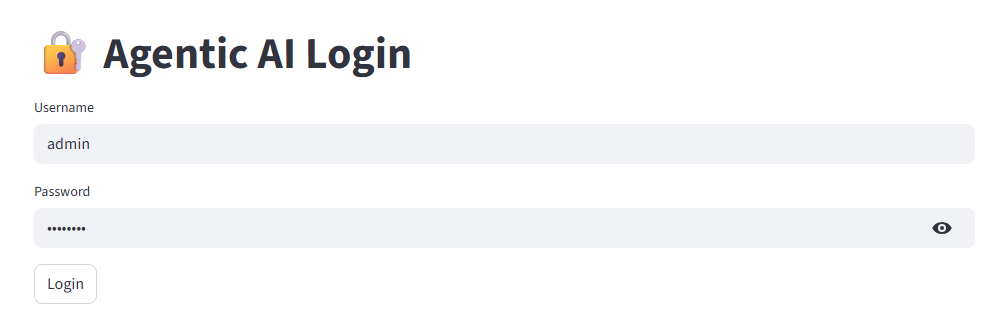

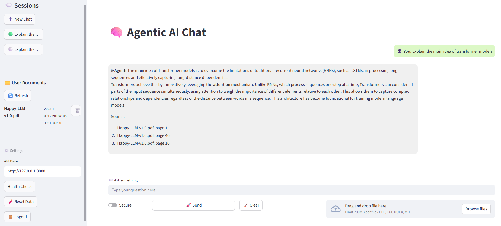


### Test Case 2 — Gmail API (Summarize emails)

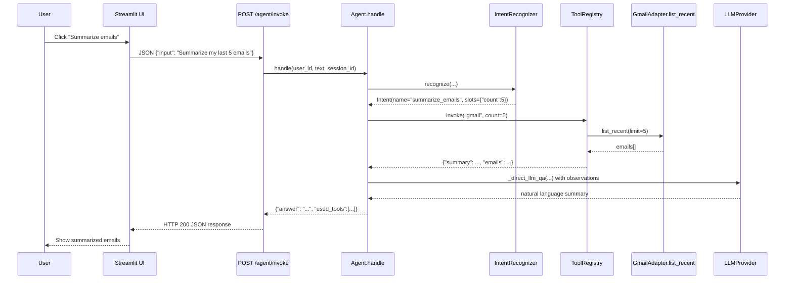

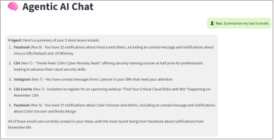

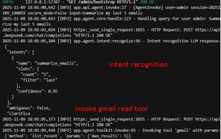

### Test Case 3 — Weather API (Singapore weather)

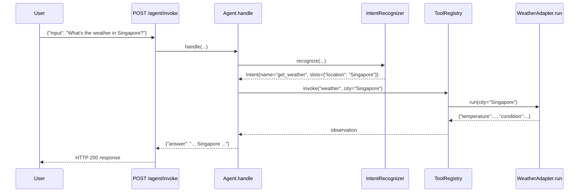

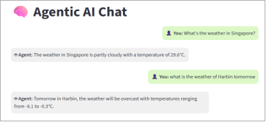

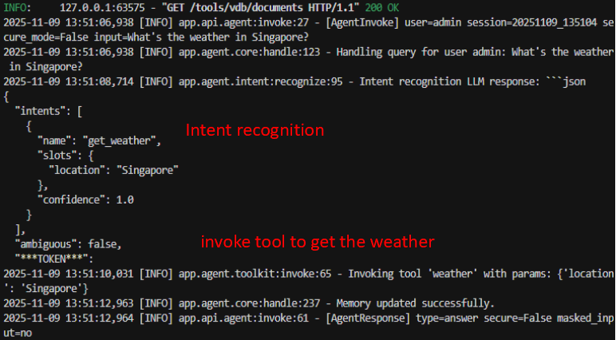


### Test Case 4 — Souce-Aware Vector DB Retrieval

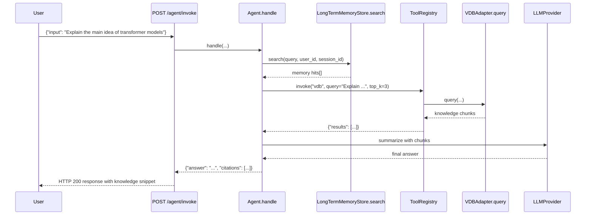
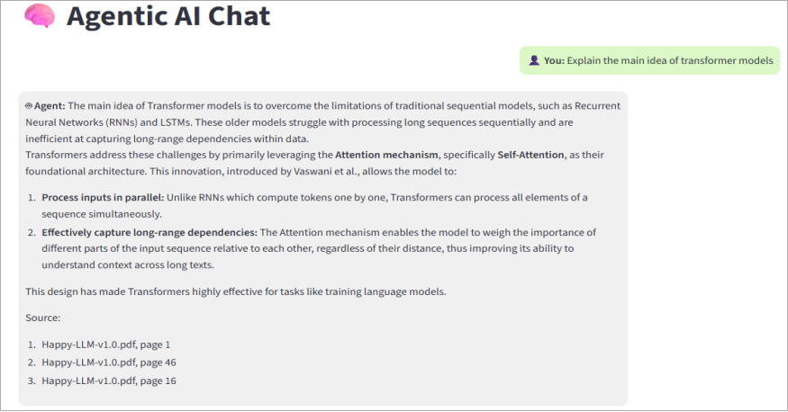

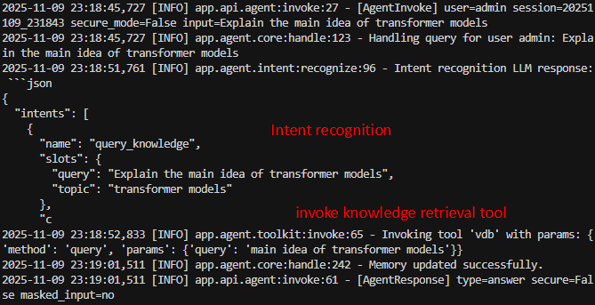

### Test Case 5 — Privacy & Security Guardrails

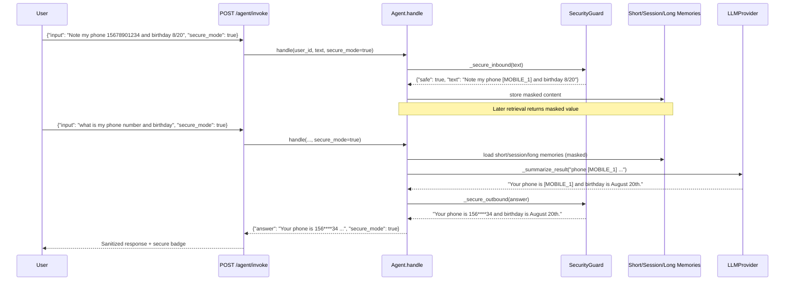

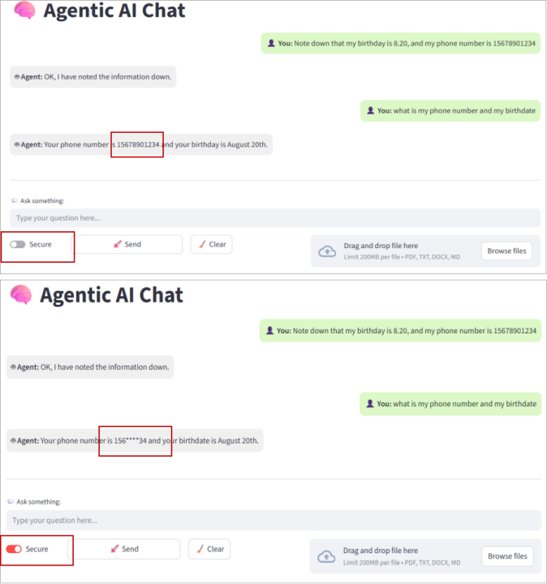


